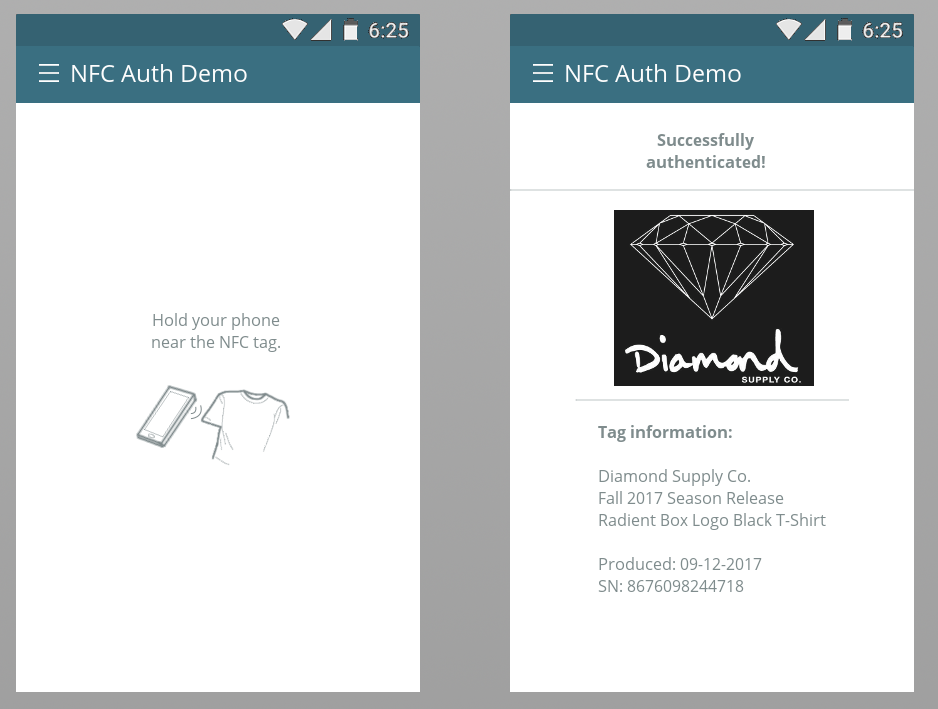
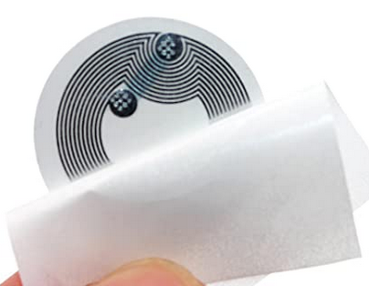

# NFC-AuthDemo

Prototype android app that can read NFC tags to authenticate products - e.g. clothing.

Screenshots of UI:

For testing, wrote test data to 504 Byte NXP NTAG 215 Tags:

Embedded these test tags into test shirts and hoodies. Smartphone and Android app are able to read the tag's data.
